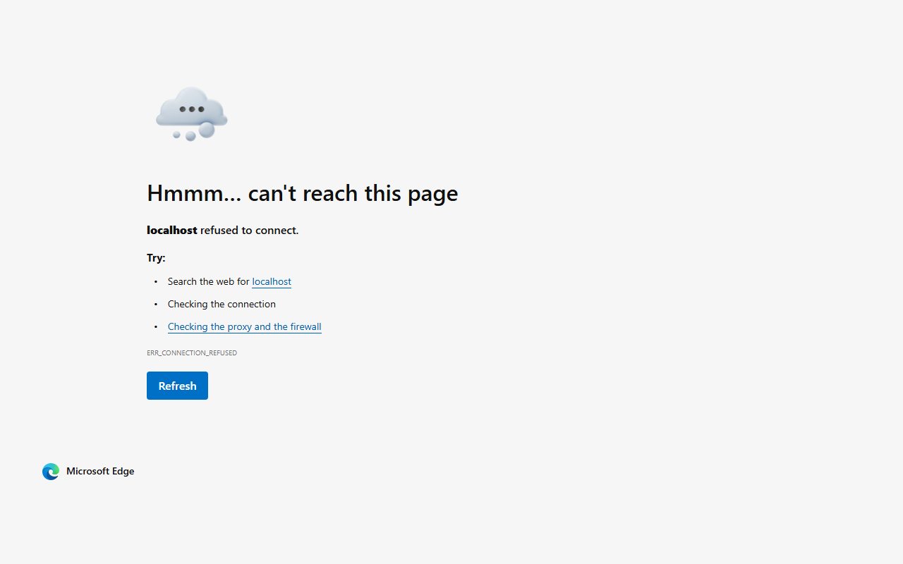

# QR Code Generator

A simple, lightweight web-based QR code generator built by [Zozimus Technologies](https://github.com/zozimustechnologies). Enter any text or URL and instantly generate a scannable QR code image.



## Features

- **Instant QR Code Generation** - Type any text or URL and click "Generate QR code" to create a QR code on the fly.
- **Powered by QR Server API** - Uses the reliable [goqr.me API](https://goqr.me/api/) to generate high-quality QR codes.
- **Clean, Minimal UI** - A centered card layout with a modern blue theme for a distraction-free experience.
- **No Installation Required** - Pure HTML, CSS, and JavaScript. Just open `index.html` in your browser.
- **Responsive Design** - Works on desktops, tablets, and mobile devices.
- **View Source Code** - Quick-access button to jump to the GitHub repository.
- **Donate Button** - Support the developer directly via Wise.

## Getting Started

1. **Clone the repository**

   ```bash
   git clone https://github.com/zozimustechnologies/qrcodegenerator.git
   cd qrcodegenerator
   ```

2. **Open in your browser**

   Simply open `index.html` in any modern web browser. No build step or server required.

3. **Generate a QR code**

   - Enter a URL or any text in the input field.
   - Click **Generate QR code**.
   - The QR code image will appear below the input.

## Project Structure

| File | Description |
|------|-------------|
| `index.html` | Main HTML page with the input form and layout |
| `style.css` | Styling with blue theme, card layout, and buttons |
| `backend.js` | JavaScript logic to call the QR code API and display the result |
| `images/` | Favicon, icon, and screenshot assets |

## Technologies Used

- **HTML5**
- **CSS3** (Google Fonts - Noto Sans, Material Symbols)
- **JavaScript** (Vanilla)
- **[QR Server API](https://goqr.me/api/)**

## License

Copyright 2026 Zozimus Technologies
