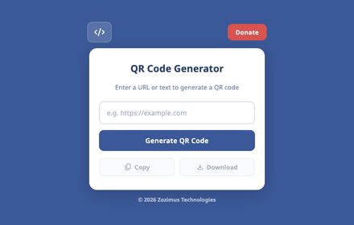
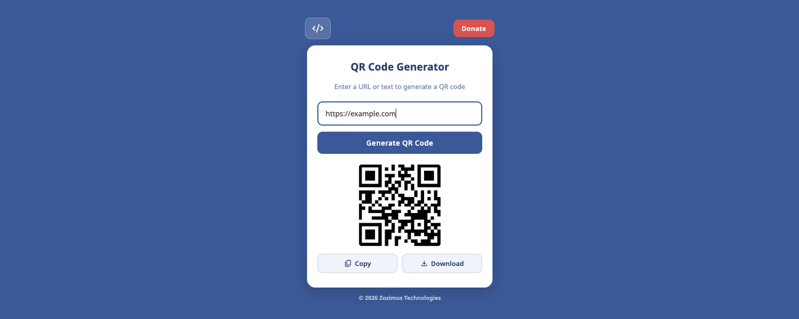

# QR Code Generator

A simple, lightweight web-based QR code generator built by [Zozimus Technologies](https://github.com/zozimustechnologies). Enter any text or URL and instantly generate a scannable QR code image.

## Screenshot

## Demo

## Screenshots

| Size | Preview |
|------|---------|
| 440×280 |  |
| 1280×800 |  |
| 1400×560 |  |

## Features

- **Instant QR Code Generation** - Type any text or URL and click "Generate QR code" to create a QR code on the fly.
- **Clean, Minimal UI** - A centered card layout with a modern blue theme for a distraction-free experience.
- **No Installation Required** - Pure HTML, CSS, and JavaScript. Just open `index.html` in your browser.
- **Responsive Design** - Works on desktops, tablets, and mobile devices.
- **View Source Code** - Quick-access button to jump to the GitHub repository.
- **Donate Button** - Support the developer directly via Wise.

## Install

[**Get it from the Edge Add-ons store**](https://microsoftedge.microsoft.com/addons/detail/qr-code-generator/kcjdgoccjamenahcmpipbdcfkpnknami)

## Getting Started

1. **Open the website**

 [The QRCode Generator](https://the-qrcode-generator.netlify.app/)
2. **Generate a QR code**

   - Enter a URL or any text in the input field.
   - Click **Generate QR code**.
   - The QR code image will appear below the input.

## Project Structure

| File / Folder | Description |
|------|-------------|
| `index.html` | Main HTML page with the input form and layout |
| `style.css` | Styling with blue theme, card layout, and buttons |
| `backend.js` | JavaScript logic to call the QR code API and display the result |
| `images/` | Favicon, icon, and screenshot assets |
| `extension/` | Chrome/Edge side panel extension (manifest, icons, screenshots, demo) |

## Technologies Used

- **HTML5**
- **CSS3** (Google Fonts - Noto Sans, Material Symbols)
- **JavaScript** (Vanilla)
- **[QR Server API](https://goqr.me/api/)**

## Changelog

### v5.1.0 — 26 April 2026

- **Copy button** — Copy the generated QR code image directly to your clipboard with one click.
- **Download button** — Save the QR code as a PNG file (`qrcode.png`) to your device.
- **Input validation** — Clicking "Generate QR Code" with an empty field now shows an inline error message instead of silently doing nothing.
- **Disabled state** — Copy and Download buttons are visible but disabled until a QR code has been generated.
- **Bug fix** — Removed pointer cursor and tooltip from the QR code image.
- **Website restructure** — Web UI moved to `/web` directory; Netlify deployment configured via `netlify.toml`.

---

## License

Copyright &copy 2026 Zozimus Technologies

