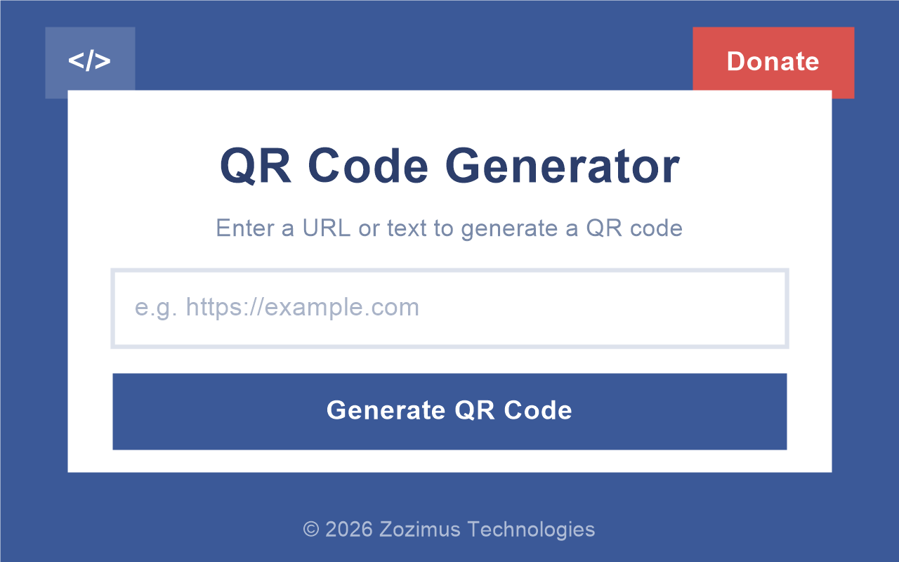
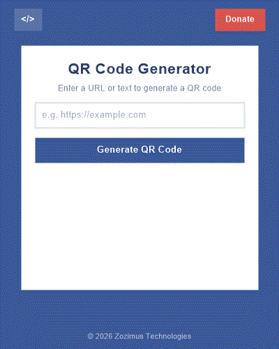

# QR Code Generator — Browser Extension

Generate QR codes instantly for any URL or text, right from your browser sidebar.

---

## What It Does

QR Code Generator is a simple, fast, and privacy-friendly browser extension that lets you create QR codes on the fly. Just type or paste any URL or text, click **Generate QR Code**, and your QR code appears instantly — ready to scan.

---

## Key Features

- **Instant QR Code Generation** — Enter any URL or text and get a scannable QR code in seconds.
- **Side Panel Experience** — Opens in the browser sidebar so you can generate QR codes without leaving your current tab.
- **No Sign-Up Required** — Works right away. No account, no login, no setup.
- **Lightweight & Fast** — Minimal footprint. No background processes or heavy resource usage.
- **Privacy-Friendly** — No data collection, no tracking, no ads. Your input stays between you and the QR code.
- **Clean, Modern UI** — A distraction-free card layout with a polished blue theme.

---

## How to Use

1. Click the **QR Code Generator** icon in your browser toolbar.
2. The extension opens in the **side panel**.
3. Type or paste a URL or any text into the input field.
4. Click **Generate QR Code**.
5. Your QR code appears instantly — scan it with any mobile device.

---

## Who Is It For?

- **Developers** sharing localhost or staging URLs with teammates.
- **Marketers** creating QR codes for campaigns, flyers, or social media.
- **Students & Teachers** sharing links quickly in classrooms.
- **Anyone** who needs a QR code without visiting a separate website.

---

## Permissions

This extension only requests the minimum permissions needed:

| Permission | Why |
|---|---|
| **sidePanel** | To display the QR code generator in the browser sidebar. |

No access to your browsing history, tabs, or personal data.

---

## Support the Developer

If you find this extension useful, consider supporting the developer via the **Donate** button inside the extension.

---

## Links

- [Source Code on GitHub](https://github.com/zozimustechnologies/qrcodegenerator)
- [Report an Issue](https://github.com/zozimustechnologies/qrcodegenerator/issues)

---

© 2026 [Zozimus Technologies](https://github.com/zozimustechnologies)
